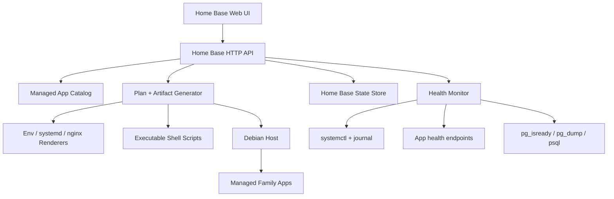
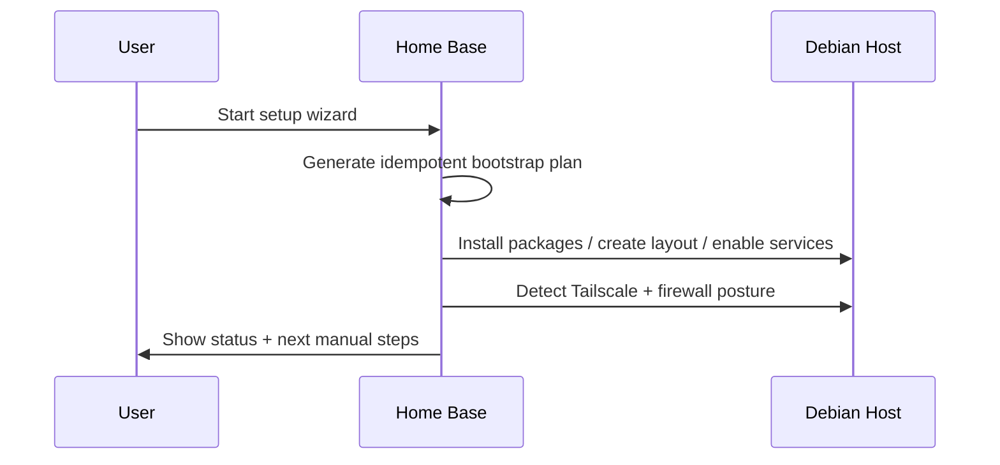
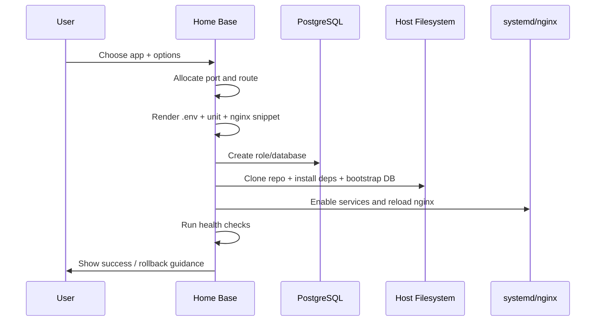

# Home Base Architecture

## 1. Why Home Base exists

The existing Sovereign Home suite already works in production, but every repo ships its own host-level deployment conventions. Home Base becomes the shared control plane that turns those conventions into a safe, family-friendly product.

## 2. What the repo review showed

### Shared patterns across the suite

- **Host-native deployment:** systemd + nginx + PostgreSQL, not Docker orchestration.
- **Git-based updates:** each app has a `deploy.sh` that fetches, installs dependencies, runs DB work, then restarts services.
- **Vanilla web apps:** the Node apps are small Express servers with static HTML/CSS/JS and no build step.
- **Debian/Ubuntu assumptions:** service files, nginx snippets, and deploy scripts all assume a Debian-family host.
- **Tailscale/LAN-first posture:** apps are intended for private household access.

### Important inconsistencies Home Base must absorb

| App | Runtime | Health | DB bootstrap | Extra process | Operational wrinkle |
|---|---|---|---|---|---|
| Family Pulse | Node | `/api/health` | migrations | MCP sidecar | in-process cron + Plaid callback needs public HTTPS |
| Family Help | Node | no real health endpoint | migrations | reminder timer | repo-local uploads must be backed up |
| Family Dinner | Node | synthetic only | migrations + schema bootstrap | none | no auth yet, no dedicated health endpoint |
| Family Plan | Node | `/api/status` | `schema.sql` + runtime compat | none | important config also lives in DB |
| Bitcoin Accounting | Python | `/api/health`, `/api/ready` | `src/sql/tables.sql` + init command | none | repo-local `.venv`, strict base-path contract |

## 3. Recommended target architecture

### Components

#### A. Home Base web app
- Primary UI for setup, install, update, backup, logs, and restore.
- PWA-friendly and readable on desktop + mobile.
- Initial slice uses a no-build Node HTTP server to stay aligned with the suite’s existing operational style.

#### B. Catalog + manifest contract
- A first-class machine-readable manifest per app.
- Defines repository, runtime, DB bootstrap, service units, health endpoints, proxy strategy, backup paths, and update channel.
- Lets Home Base manage apps consistently even when their repos differ internally.

#### C. Planner/executor split
- **Planner** produces deterministic install/update/backup plans and renderable artifacts.
- **Executor** is a later phase that runs approved plans on-host with privilege boundaries.
- This split is important because destructive actions must be reviewable and reversible for non-engineers.

#### D. State store
- Near-term implementation: local JSON state for generated plans and planned installs.
- Recommended pre-GA upgrade: SQLite for durable state, history, rollback metadata, and job logs.
- PostgreSQL is reserved for the managed apps; Home Base should not depend on app PostgreSQL being healthy in order to operate.

#### E. Host integration layer
- Debian-only command adapters for:
  - package installation
  - systemd unit lifecycle
  - nginx config generation + validation
  - PostgreSQL role/database creation
  - backup scheduling with systemd timers
  - Tailscale detection and status checks

## 4. Control-plane data flow

### Bootstrap flow

### App installation flow

## 5. Technology choices

### Home Base runtime: Node.js, no build step
**Why:**
- Matches four of five current managed apps.
- Keeps packaging simple on Debian.
- Easy to understand and debug for contributors already working in the suite.

### Home Base state: JSON now, SQLite next
**Why:**
- JSON keeps the first slice dependency-free.
- SQLite is the right follow-on for durability, job history, and backups without coupling to PostgreSQL availability.

### Reverse proxy: nginx snippets generated by Home Base
**Why:**
- Existing apps already assume nginx.
- Generated snippets normalize header handling and path stripping.
- Home Base can enforce one routing pattern instead of per-repo copy/paste.

### Service management: systemd only
**Why:**
- Matches current production reality.
- Provides restart policy, timers, logs, and simple health hooks.
- Avoids a parallel process manager story.

## 6. Key design decisions shaped by repo review

1. **Do not blindly reuse each repo’s existing unit files.**
   They hard-code founder-specific paths and usernames.
2. **Do not auto-run seed SQL in production installs.**
   Several apps ship founder-specific or destructive seed data.
3. **Health must combine HTTP + systemd.**
   Some apps already have health endpoints, some do not.
4. **The manifest is the abstraction boundary.**
   It lets Home Base hide migration and routing inconsistencies.
5. **Rollback needs pre-operation backups.**
   Current deploy scripts restart in place; Home Base must add safer guardrails.

## 7. Security posture

- Tailnet/private network access remains the primary exposure boundary.
- Home Base should still require a local admin secret/PIN before executing destructive operations.
- Secrets stay on-host in rendered env/config artifacts; no cloud dependency.
- Home Base should never show raw secret values after initial save.

## 8. What this initial code slice implements

- built-in managed-app catalog
- manifest schema
- bootstrap plan generation
- install plan generation with:
  - `.env` rendering
  - systemd unit rendering
  - nginx snippet rendering
  - executable shell script rendering
- local state tracking for planned installs

## 9. What should land next

1. SQLite state store
2. privileged executor with approval + rollback checkpoints
3. health polling dashboard
4. backup/restore engine
5. update orchestration
6. onboarding wizard and admin auth
